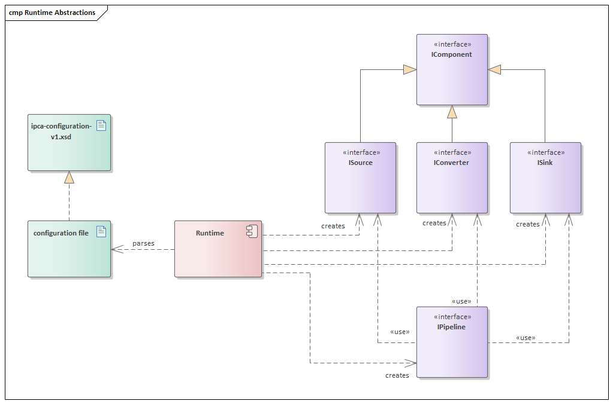
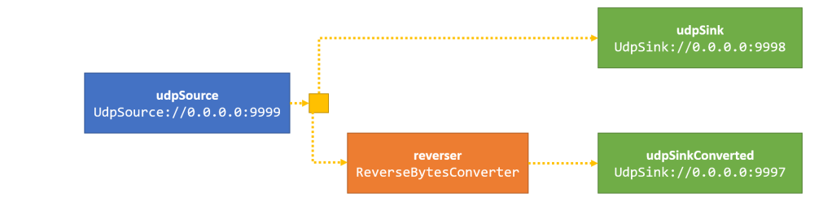

# Using ipc-adapter

## Terminology
ipc-adapter provides

- *components* that provide means as to receive, convert and send data
   - sources that receive data from the outside
   - converters that convert and filter data
   - sinks that publish data to the outside
- *pipelines* that connect these components with each other to provide the actual processing means.
- all *components* are instantiated by a *runtime*
- the *runtime* parses a *configuration file* for that



## Configuration
The *configuration file* is an XML file that MUST follow [ipca-configuration-v1.xsd](../20_Sources/IpcAdapter/Core/cfg/ipca-configuration-v1.xsd).

It consists of two sections
- the `<components>` definition and configuration
- the `<pipelines>` definition, referencing components created before


### Example
The following snippet
- creates four components
    - a source that receives UDP datagrams at `0.0.0.0:9999`
    - a converter that reverses all the bytes passing through it
    - a sink that sends the data it receives via UDP datagram to `127.0.0.1:9998` and another one sending to `127.0.0.1:9997`
- creates two pipeline
    - one that just receives UDP data on `:9999` and sends them to `:9998`
    - one that also receives UDP data on `:9999`, reverses the bytes received and sends those reversed bytes to `:9997`



```xml
<?xml version="1.0" encoding="UTF-8"?>
<configuration version="1" xmlns="urn:ipca-configuration-v1"
    xmlns:xsi="http://www.w3.org/2001/XMLSchema-instance"
    xsi:schemaLocation="urn:ipca-configuration-v1 ipca-configuration-v1.xsd">

    <components>
        <component id="udpSource" type="UdpSource">
            <param key="host" value="0.0.0.0"/>
            <param key="port" value="9999"/>
        </component>

        <component id="udpSink" type="UdpSink">
            <param key="host" value="127.0.0.1"/>
            <param key="port" value="9998"/>           
        </component>
        
        <component id="reverser" type="ReverseBytesConverter"/>
        
        <component id="udpSinkConverted" type="UdpSink">
            <param key="host" value="127.0.0.1"/>
            <param key="port" value="9997"/>           
        </component>
    </components>

    <pipelines>
        <pipeline id="p1">
            <source ref="udpSource"/>
            <converter ref="reverser"/>
            <sink ref="udpSinkConverted"/>
        </pipeline>
        
        <pipeline id="p2">
            <source ref="udpSource"/>
            <sink ref="udpSink"/>
        </pipeline>                
    </pipelines>

</configuration>
```

## Usage
Just invoke the `IpcAdapterApplication` binary and pass the *configuration file* as parameter.
