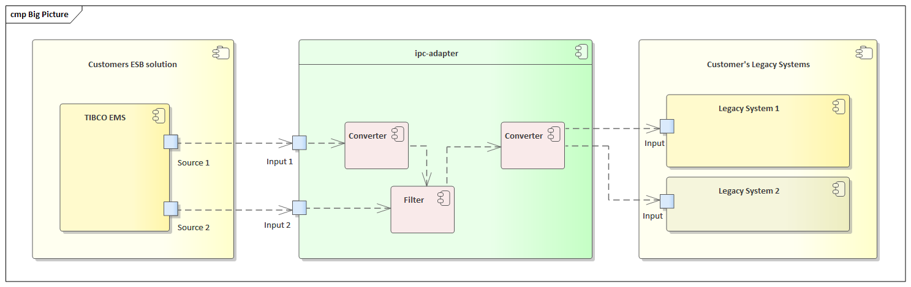

# ipc-adapter

Study for an _inter-process adapter_ in C++/Qt 5.

## Key words for use in RFCs to Indicate Requirement Levels
The key words "MUST", "MUST NOT", "REQUIRED", "SHALL", "SHALL NOT", "SHOULD", "SHOULD NOT", "RECOMMENDED",  "MAY", and "OPTIONAL" in this document and other documents in this repository are to be interpreted as described in [RFC 2119](https://www.ietf.org/rfc/rfc2119.txt).

## Big Picture / Solution to Realize

Customer has
- a **legacy system** that needs to be connected to 
- a new **ESB solution**.

We assume that we 
- receive data in some format from the ESB and 
- need to _convert_, _merge_ and _filter_ it, before 
- forwarding it to the **legacy system**.

## Documentation
- [Usage](00_Documentation/Usage.md)
- [System Requirements](00_Documentation/System_Requirements.md)
- [Design Decisions](00_Documentation/Design_Decisions.md)
- [Coding Rules](00_Documentation/Coding_Rules.md) and [Naming Conventions](00_Documentation/Naming_Conventions.md)

## Sources

Refer to [20_Sources](20_Sources/).

## License

Refer to [LICENSE](LICENSE)
