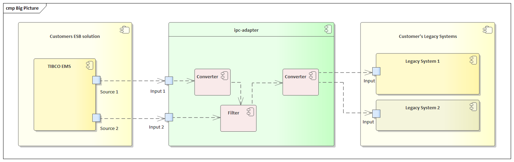

# ipc-adapter

Study for an _inter-process adapter_ in C++/Qt 5.

## Big Picture / Solution to Realize

Customer has
- a **legacy system** that needs to be connected to 
- a new **ESB solution**.

We assume that we 
- receive data in some format from the ESB and 
- need to _convert_, _merge_ and _filter_ it, before 
- forwarding it to the **legacy system**.

## Documentation

- System Requirements
- Design Decisions
- Coding Rules and Naming Conventions

## Sources

Refer to XYZ.

## License

Refer to [LICENSE](LICENSE)
